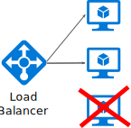
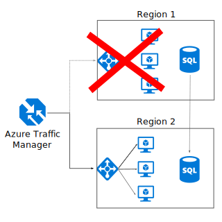

# Make all things redundant

**Build redundancy into your application, to avoid having single points of failure.**

A resilient application routes around failure. Identify the critical paths in your application. Is there redundancy at each point in the path? If a subsystem fails, will the application fail over to something else?

## Considerations 

**Consider business requirements.** The amount of redundancy built into a system can affect both cost and complexity. Your architecture should be informed by your business requirements, such as recovery time objective (RTO). For example, a multi-region deployment is more expensive than a single-region deployment, and is more complicated to manage. You will need operational procedures to handle failover and failback. The additional cost and complexity might be justified for some business scenarios and not others.

**Place VMs behind a load balancer**. Don't use a single VM for mission-critical workloads. Instead, place multiple VMs behind a load balancer. If any VM becomes unavailable, the load balancer distributes traffic to the remaining healthy VMs. To learn how to deploy this configuration, see [Multiple VMs for scalability and availability][multi-vm-blueprint].

**Replicate databases.** Use a database solution that supports replication and failover, such as [SQL Server Always On Availability Groups][sql-always-on]. Managed services such as Azure SQL Database and DocumentDB automatically replicate the data within a region, and provide opt-in replication across regions.

**Enable geo-replication** for [Azure SQL Database][sql-geo-replication] and [DocumentDB][docdb-geo-replication] databases. Geo-replication creates secondary readable replicas of your data in one ore more secondary regions. In the event of an outage, the database can fail over to the secondary region for writes.

**Partition for availability.** Database partitioning is often used to improve scalability, but it can also improve availability. If one shard goes down, the other shards can still be reached. A failure in one shard will only disrupt a subset of the total transactions. 

**Deploy to more than one region.** For the highest availability, deploy the application to more than one region. That way, in the rare case when a problem affects an entire region, the application can fail over to another region. The following diagram shows a multi-region application that uses Azure Traffic Manager to handle failover.

**Synchronize front and backend failover.** Use Azure Traffic Manager to fail over the front end. If the front end becomes unreachable in one region, Traffic Manager will route new requests to the secondary region. Depending on your database solution, you may need to coordinate failing over the database. 

**Use automatic failover but manual failback.** Use Traffic Manager for automatic failover, but not for automatic failback. Automatic failback carries a risk that you might switch to the primary region before the region is completely healthy. Instead, verify that all application subsystems are healthy before manually failing back. Also, depending on the database, you might need to check data consistency before failing back.

**Include redundancy for Traffic Manager.** Traffic Manager is a possible failure point. Review the Traffic Manager SLA, and determine whether using Traffic Manager alone meets your business requirements for high availability. If not, consider adding another traffic management solution as a failback. If the Azure Traffic Manager service fails, change your CNAME records in DNS to point to the other traffic management service.

<!-- links -->

[multi-vm-blueprint]: ../../reference-architectures/virtual-machines-windows/multi-vm.md

[cassandra]: http://cassandra.apache.org/
[docdb-geo-replication]: /azure/documentdb/documentdb-distribute-data-globally
[sql-always-on]: https://msdn.microsoft.com/library/hh510230.aspx
[sql-geo-replication]: /azure/sql-database/sql-database-geo-replication-overview
